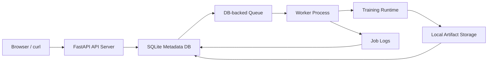
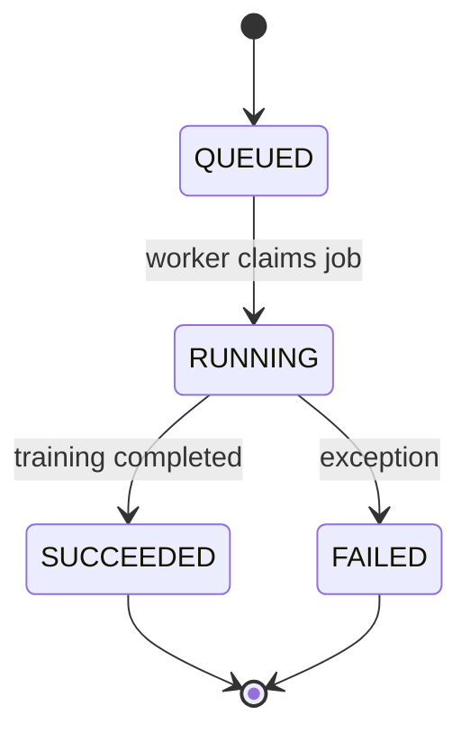

# Architecture

The first version is a single-machine Mini AI Platform. It separates the control plane from the execution plane while keeping dependencies small.

## Job Lifecycle

## Data Flow

1. User submits `POST /api/jobs`.
2. API writes a row to `jobs` with `status=QUEUED`.
3. Worker polls SQLite and atomically claims the oldest queued job.
4. Worker runs the training runtime and streams logs into `job_logs`.
5. Trainer writes checkpoints, metrics, and final model files under `storage/artifacts/<job_id>/`.
6. Worker records artifact metadata and marks the job `SUCCEEDED` or `FAILED`.
7. UI polls `/api/jobs`, `/api/jobs/{job_id}/logs`, and `/api/jobs/{job_id}/artifacts`.

## Why SQLite Queue First?

The platform abstraction matters more than distributed infrastructure in v1. A DB-backed queue is enough to expose the important concepts:

- Job state transitions
- Worker claiming
- Async execution
- Logs
- Artifacts
- Failure handling

Redis, Docker, and Kubernetes can be added after this lifecycle is solid.

