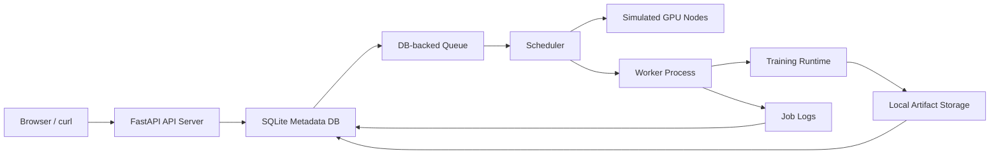
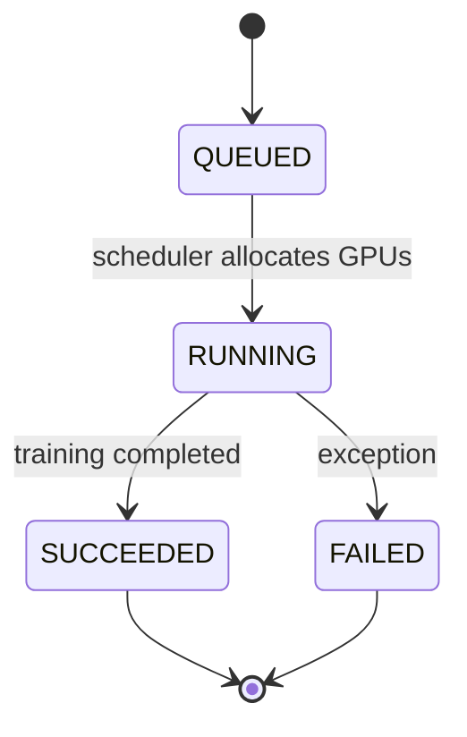

# Architecture

The first version is a single-machine Mini AI Platform. It separates the control plane from the execution plane while keeping dependencies small.

## Job Lifecycle

## Data Flow

1. User submits `POST /api/jobs`.
2. API writes a row to `jobs` with `status=QUEUED`, `requested_gpus`, and `priority`.
3. Worker asks the scheduler to claim one queued job.
4. Scheduler finds the best-fit node with enough available GPUs.
5. Scheduler atomically marks the job `RUNNING`, records `allocated_node_id`, and increments `used_gpus`.
6. Worker runs the training runtime and streams logs into `job_logs`.
7. Trainer writes checkpoints, metrics, and final model files under `storage/artifacts/<job_id>/`.
8. Worker records artifact metadata and marks the job `SUCCEEDED` or `FAILED`.
9. Worker releases the simulated GPU allocation.
10. UI polls `/api/jobs`, `/api/scheduler`, `/api/jobs/{job_id}/logs`, and `/api/jobs/{job_id}/artifacts`.

## Scheduler V2

The second version adds a simulated GPU cluster:

| Node | GPUs |
| --- | ---: |
| Node A | 8 |
| Node B | 4 |
| Node C | 2 |

Jobs declare `requested_gpus`. The scheduler uses a best-fit policy: among nodes with enough free GPUs, pick the node that leaves the least remaining capacity. This makes fragmentation visible in a small local system.

If no node can fit a queued job, the job stays `QUEUED`. Later, when a running job finishes and releases resources, the worker can claim the waiting job.

## Why SQLite Queue First?

The platform abstraction matters more than distributed infrastructure in v1. A DB-backed queue is enough to expose the important concepts:

- Job state transitions
- Worker claiming
- Async execution
- Logs
- Artifacts
- Failure handling

Redis, Docker, and Kubernetes can be added after this lifecycle is solid.
